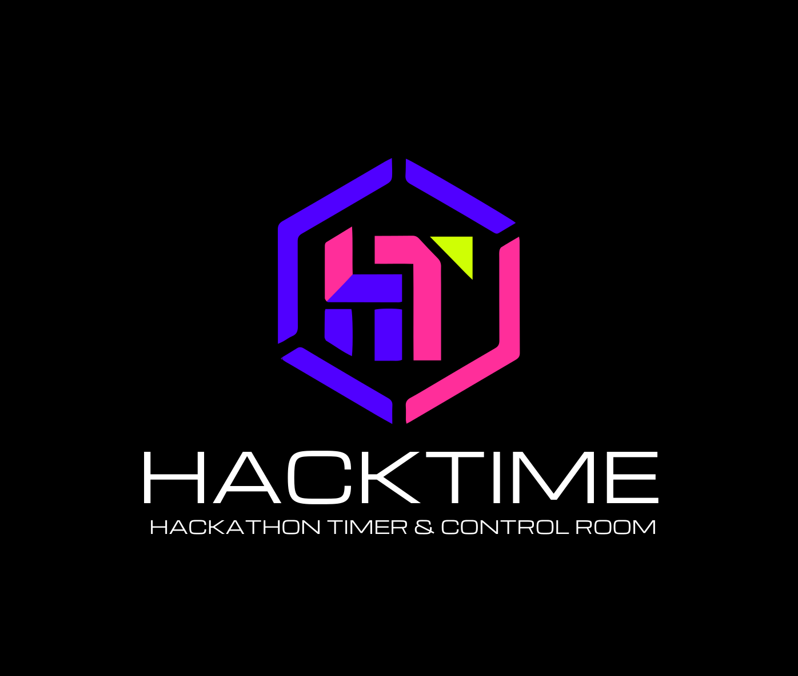
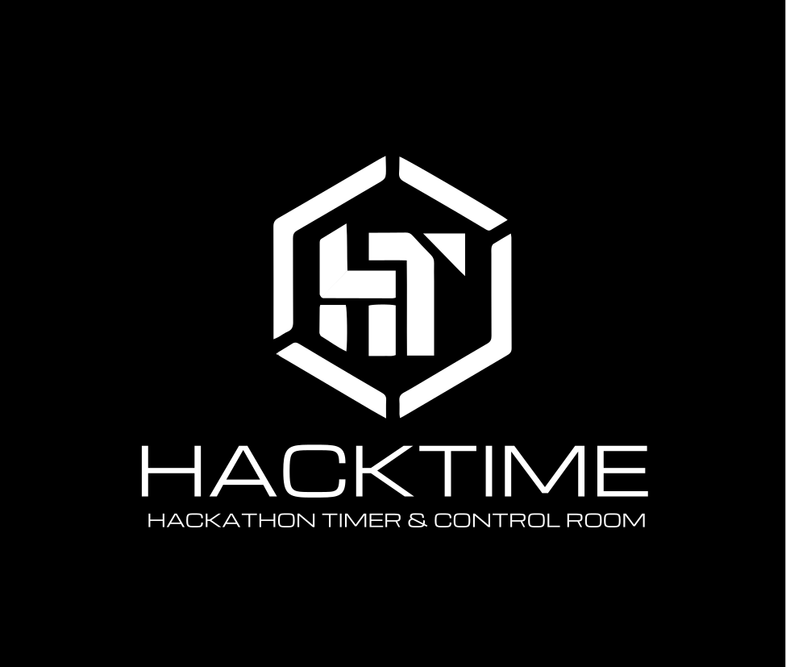
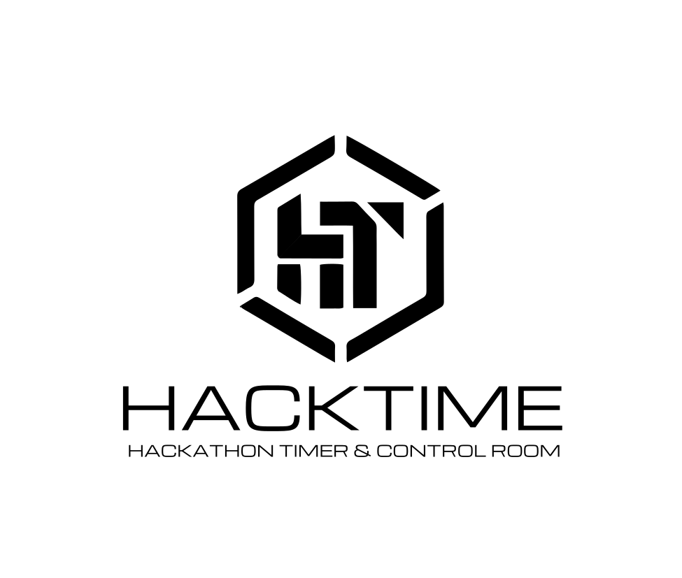

# hackTime
<p align="center">
   
</p>

<p align="center"><strong>Hackathon Control Room for Organizers, Stage Screens, and Participants</strong></p>


hackTime is a hackathon control room for organizers, stage screens, and participants. It lets you create a timed event flow, launch a live countdown, broadcast announcements, and share a room code so teams can join the clock view instantly.

## Who It's For

- Organizers who need a command center for multi-phase hackathons
- Stage or AV teams who need a clean public countdown screen
- Participants who want to join a room and follow the live schedule

## What Users Can Do

- Create an organizer account and manage hackathon sessions
- Build a custom event flow with named phases and durations
- Launch a room with a 6-character room ID
- Pause, resume, skip, or stop a live event
- Send timed broadcast announcements to everyone in the room
- Open a dedicated stage view for projection screens
- Let participants join a room without creating an account

## Product Views

- Organizer dashboard: `/dashboard`
- Flow builder: `/flow`
- Login and guest join: `/login`
- Stage standby or active stage view: `/stage` and `/room/<ROOM_ID>/stage`
- Participant clock view: `/room/<ROOM_ID>/clock`

## Live Deployment

- Experimental: `https://hackclock.vercel.app/`
- Production: `https://hackclock.vercel.app/`

## Local Setup

hackTime is split into two apps:

- `hackclock/` for the Next.js frontend
- `backend/` for the Express and MongoDB API

### 1. Install dependencies

```bash
cd hackclock
npm install
```

```bash
cd backend
npm install
```

### 2. Configure environment variables

Create `backend/.env`:

```env
MONGODB_URI=your_mongodb_connection_string
PORT=5000
```

Create `hackclock/.env.local`:

```env
NEXT_PUBLIC_API_URL=http://localhost:5000
NEXTAUTH_SECRET=replace_with_a_long_random_secret

# Optional: enable GitHub sign-in
GITHUB_ID=
GITHUB_SECRET=
```

### 3. Start the backend

```bash
cd backend
npm run dev
```

The API runs at `http://localhost:5000`.

### 4. Start the frontend

```bash
cd hackclock
npm run dev
```

For the live app, use:

- Experimental: `https://hackclock.vercel.app/`
- Production: `https://hacktime.vercel.app/`

## How To Use hackTime

### For organizers

1. Open a deployed login page:
   Experimental: `https://hackclock.vercel.app/login`
   Production: `https://hacktime.vercel.app/login`
2. Create an account or sign in.
3. Go to `/flow` and create your hackathon.
4. Add your event name, dates, timezone, branding, and phases.
5. Deploy the flow to generate a room ID.
6. Use the dashboard to control the live room and send announcements.

### For participants

1. Open a deployed login page:
   Experimental: `https://hackclock.vercel.app/login`
   Production: `https://hacktime.vercel.app/login`
2. Choose `GUEST`.
3. Enter a team name and the room ID.
4. Join the room to open the live clock view.

### For stage screens

1. Open `/stage` if you are signed in as the organizer with an active room.
2. Or open `/room/<ROOM_ID>/stage` directly for a specific event.

## Notes

- Participants can join without an account.
- Room IDs are generated automatically when a flow is deployed.
- Draft flows can be saved and launched later.
- MongoDB is required for local development.

## Project Structure

```text
.
├── backend/      # Express API, auth, room state, MongoDB models
├── hackclock/    # Next.js frontend for organizers, stage, and participants
├── LICENSE
└── README.md
```

## Troubleshooting

### The frontend loads but actions fail

Check that:

- the backend is running on port `5000`
- `NEXT_PUBLIC_API_URL` points to the backend
- MongoDB is reachable from the backend

### Login does not work

Check that:

- `NEXTAUTH_SECRET` is set in `hackclock/.env.local`
- the backend is running
- your account exists if using email and password login

### The room page says it was not found

Check that:

- the room ID is correct
- the hackathon was deployed, not just saved as a draft
- the backend database contains the room record

## Brand Logos

<p>
   
   
   
</p>


## License

This project is licensed under the [MIT License](/data/programing/GitHub/HackClock/hacktime/LICENSE).
